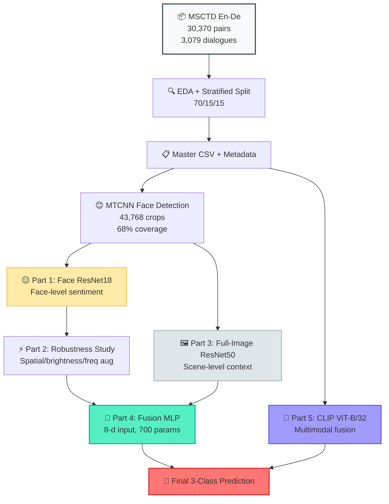

<!-- Human Sentiment Analysis README — EEEM068 University of Surrey -->
<!-- Designed as a scroll-journey experience. Best viewed on GitHub. -->

<p align="center">
  <!-- SVG Sentiment Wave Header -->
  <svg viewBox="0 0 800 200" xmlns="http://www.w3.org/2000/svg" width="100%" style="max-width: 800px;">
    <defs>
      <linearGradient id="sentGrad" x1="0%" y1="0%" x2="100%" y2="0%">
        <stop offset="0%" stop-color="#e74c3c" />
        <stop offset="50%" stop-color="#f39c12" />
        <stop offset="100%" stop-color="#27ae60" />
      </linearGradient>
      <filter id="glow" x="-20%" y="-20%" width="140%" height="140%">
        <feGaussianBlur stdDeviation="3" result="blur" />
        <feComposite in="SourceGraphic" in2="blur" operator="over" />
      </filter>
    </defs>
    
    <!-- Background subtle grid -->
    <pattern id="grid" width="40" height="40" patternUnits="userSpaceOnUse">
      <path d="M 40 0 L 0 0 0 40" fill="none" stroke="#e0e0e0" stroke-width="0.5"/>
    </pattern>
    <rect width="800" height="200" fill="url(#grid)" opacity="0.3"/>
    
    <!-- Sentiment wave paths -->
    <path d="M0,120 Q50,80 100,110 T200,100 T300,90 T400,100 T500,85 T600,95 T700,80 T800,90" 
          fill="none" stroke="url(#sentGrad)" stroke-width="4" stroke-linecap="round" opacity="0.6"/>
    <path d="M0,130 Q50,100 100,120 T200,115 T300,105 T400,115 T500,100 T600,110 T700,95 T800,105" 
          fill="none" stroke="url(#sentGrad)" stroke-width="2" stroke-linecap="round" opacity="0.4"/>
    
    <!-- Emojis as nodes -->
    <text x="60" y="75" font-size="28" text-anchor="middle">😢</text>
    <text x="260" y="75" font-size="28" text-anchor="middle">😐</text>
    <text x="460" y="75" font-size="28" text-anchor="middle">🙂</text>
    <text x="660" y="75" font-size="28" text-anchor="middle">😄</text>
    
    <!-- Main Title -->
    <text x="400" y="155" font-family="-apple-system, BlinkMacSystemFont, 'Segoe UI', Helvetica, Arial, sans-serif" 
          font-size="32" font-weight="bold" text-anchor="middle" fill="#2c3e50" filter="url(#glow)">
      Human Sentiment Analysis
    </text>
    <text x="400" y="180" font-family="-apple-system, BlinkMacSystemFont, 'Segoe UI', Helvetica, Arial, sans-serif" 
          font-size="14" text-anchor="middle" fill="#7f8c8d">
      MSCTD En-De · Multimodal · 3-Class Classification
    </text>
  </svg>
</p>

<p align="center">
  <a href="https://pytorch.org"></a>
  <a href="https://python.org"></a>
  <a href="https://jupyter.org"></a>
  <a href="https://huggingface.co"></a>
  <br/>
  <a href="https://github.com/harshithaammineni/Human-Sentiment-Analysis/stargazers"></a>
  <a href="https://github.com/harshithaammineni/Human-Sentiment-Analysis/network/members"></a>
  
  
</p>

---

<!-- Sentiment Spectrum Bar -->
<p align="center">
  <svg viewBox="0 0 700 60" xmlns="http://www.w3.org/2000/svg" width="100%" style="max-width: 700px;">
    <defs>
      <linearGradient id="specGrad" x1="0%" y1="0%" x2="100%" y2="0%">
        <stop offset="0%" stop-color="#e74c3c" />
        <stop offset="50%" stop-color="#f39c12" />
        <stop offset="100%" stop-color="#27ae60" />
      </linearGradient>
    </defs>
    <rect x="10" y="20" width="680" height="20" rx="10" fill="url(#specGrad)" opacity="0.9"/>
    <text x="80" y="15" font-family="sans-serif" font-size="12" font-weight="bold" fill="#c0392b" text-anchor="middle">NEGATIVE</text>
    <text x="350" y="15" font-family="sans-serif" font-size="12" font-weight="bold" fill="#d35400" text-anchor="middle">NEUTRAL</text>
    <text x="620" y="15" font-family="sans-serif" font-size="12" font-weight="bold" fill="#27ae60" text-anchor="middle">POSITIVE</text>
    <text x="80" y="55" font-family="sans-serif" font-size="11" fill="#7f8c8d" text-anchor="middle">33%</text>
    <text x="350" y="55" font-family="sans-serif" font-size="11" fill="#7f8c8d" text-anchor="middle">39%</text>
    <text x="620" y="55" font-family="sans-serif" font-size="11" fill="#7f8c8d" text-anchor="middle">28%</text>
  </svg>
</p>

<h4 align="center"><i>Can a machine feel what a face shows, an image whispers, and a word reveals?</i></h4>

---

<!-- Stats Counter Section -->
<table align="center" style="border: none;">
  <tr>
    <td align="center" width="20%">
      <h1>30,370</h1>
      <sub>Utterance-Image Pairs</sub>
    </td>
    <td align="center" width="20%">
      <h1>3,079</h1>
      <sub>Bilingual Dialogues</sub>
    </td>
    <td align="center" width="20%">
      <h1>43,768</h1>
      <sub>Face Crops Extracted</sub>
    </td>
    <td align="center" width="20%">
      <h1>0.562</h1>
      <sub>Best Macro-F1 (CLIP)</sub>
    </td>
    <td align="center" width="20%">
      <h1>18.4</h1>
      <sub>Point Gain (Multimodal)</sub>
    </td>
  </tr>
</table>

---

<!-- Model Leaderboard — Achievement Style -->
<h2 align="center">🏆 Model Leaderboard 🏆</h2>
<p align="center"><i>Ranked by Macro-F1 on the MSCTD test set. The quest for sentiment supremacy.</i></p>

<br/>

<!-- CHAMPION: CLIP -->
<table align="center" width="90%">
  <tr>
    <td width="10%" align="center"><h1>🥇</h1></td>
    <td>
      <b>🏆 CLIP Multimodal (Extra Credit) — CHAMPION</b><br/>
      <code>ViT-B/32 + Text Encoder → Linear Classifier</code><br/>
      <sub>295K trainable · 151.6M frozen · Image + Text fusion</sub>
    </td>
    <td width="15%" align="center"><b>0.570</b><br/>Accuracy</td>
    <td width="15%" align="center" style="color:#27ae60;"><b>0.562</b><br/>Macro-F1 ⭐</td>
    <td width="15%" align="center"><b>0.567</b><br/>Weighted-F1</td>
  </tr>
  <tr>
    <td colspan="5">
      <table width="100%">
        <tr><td>🔴 Negative F1</td><td>🟡 Neutral F1</td><td>🟢 Positive F1</td></tr>
        <tr>
          <td><code>████████████████████░░░░░ 0.535</code></td>
          <td><code>████████████████████████░░░ 0.629</code></td>
          <td><code>████████████████████░░░░░ 0.522</code></td>
        </tr>
      </table>
    </td>
  </tr>
</table>

<br/>

<!-- SILVER: Face ResNet18 -->
<table align="center" width="90%">
  <tr>
    <td width="10%" align="center"><h1>🥈</h1></td>
    <td>
      <b>🥈 Face ResNet18 (Original)</b><br/>
      <code>MTCNN → ResNet18 face crops → 3-class classifier</code><br/>
      <sub>Best unimodal visual model · Handles 32% zero-face, 31% multi-face</sub>
    </td>
    <td width="15%" align="center"><b>0.380</b><br/>Accuracy</td>
    <td width="15%" align="center"><b>0.378</b><br/>Macro-F1</td>
    <td width="15%" align="center"><b>0.361</b><br/>Weighted-F1</td>
  </tr>
  <tr>
    <td colspan="5">
      <table width="100%">
        <tr><td>🔴 Negative F1</td><td>🟡 Neutral F1</td><td>🟢 Positive F1</td></tr>
        <tr>
          <td><code>██████████████░░░░░░░░░░░░░ 0.389</code></td>
          <td><code>███████████████░░░░░░░░░░░░ 0.423</code></td>
          <td><code>███████████░░░░░░░░░░░░░░░░ 0.323</code></td>
        </tr>
      </table>
    </td>
  </tr>
</table>

<br/>

<!-- BRONZE: Full-image ResNet50 -->
<table align="center" width="90%">
  <tr>
    <td width="10%" align="center"><h1>🥉</h1></td>
    <td>
      <b>🥉 Full-Image ResNet50 + MLP</b><br/>
      <code>ResNet50 (frozen) → MLP classifier on full scene context</code><br/>
      <sub>Best neutral-class detector · Transfer learning backbone</sub>
    </td>
    <td width="15%" align="center"><b>0.365</b><br/>Accuracy</td>
    <td width="15%" align="center"><b>0.362</b><br/>Macro-F1</td>
    <td width="15%" align="center"><b>0.373</b><br/>Weighted-F1</td>
  </tr>
  <tr>
    <td colspan="5">
      <table width="100%">
        <tr><td>🔴 Negative F1</td><td>🟡 Neutral F1</td><td>🟢 Positive F1</td></tr>
        <tr>
          <td><code>█████████████░░░░░░░░░░░░░░ 0.345</code></td>
          <td><code>████████████████████░░░░░░░ 0.492</code></td>
          <td><code>████████░░░░░░░░░░░░░░░░░░░ 0.250</code></td>
        </tr>
      </table>
    </td>
  </tr>
</table>

<br/>

<!-- FUSION MLP -->
<table align="center" width="90%">
  <tr>
    <td width="10%" align="center"><h1>🏅</h1></td>
    <td>
      <b>🏅 Fusion MLP — Best Visual-Only Ensemble</b><br/>
      <code>Face softmax(3) + Image softmax(3) + count(1) + flag(1) → 700 params</code><br/>
      <sub>Trains in seconds · Learns class-conditional weighting · +4.1 negative F1</sub>
    </td>
    <td width="15%" align="center"><b>0.357</b><br/>Accuracy</td>
    <td width="15%" align="center"><b>0.357</b><br/>Macro-F1</td>
    <td width="15%" align="center"><b>0.366</b><br/>Weighted-F1</td>
  </tr>
  <tr>
    <td colspan="5">
      <table width="100%">
        <tr><td>🔴 Negative F1</td><td>🟡 Neutral F1</td><td>🟢 Positive F1</td></tr>
        <tr>
          <td><code>████████████████░░░░░░░░░░░ 0.430</code></td>
          <td><code>███████████████░░░░░░░░░░░░ 0.447</code></td>
          <td><code>███████░░░░░░░░░░░░░░░░░░░░ 0.192</code></td>
        </tr>
      </table>
    </td>
  </tr>
</table>

<br/>

<!-- BASELINE -->
<table align="center" width="90%">
  <tr>
    <td width="10%" align="center">⚪</td>
    <td>
      <b>Majority Baseline</b><br/>
      <code>Always predict the most frequent class (Neutral)</code>
    </td>
    <td width="15%" align="center">0.379</td>
    <td width="15%" align="center">0.183</td>
    <td width="15%" align="center">0.379</td>
  </tr>
</table>

---

<!-- Pipeline Journey -->
<h2 align="center">🗺️ The Sentiment Pipeline — A Journey</h2>

<p align="center"><i>Follow the data from raw dialogue to final prediction.</i></p>

<br/>

```
                    🎭 MSCTD En-De Dataset
                         30,370 pairs
                            │
              ┌─────────────┴─────────────┐
              ▼                           ▼
       🔍 EDA + Stratified           📝 Master CSV
           70/15/15 Split                Metadata
              │                           │
              └─────────────┬─────────────┘
                            ▼
                    ┌───────────────┐
                    │  MTCNN Detect │◄── 68% images have faces
                    │   43,768 crops │
                    └───────┬───────┘
                            │
        ┌───────────────────┼───────────────────┐
        ▼                   ▼                   ▼
   ┌─────────┐       ┌─────────────┐      ┌─────────────┐
   │ 😐 Part │       │ 🖼️ Part 3   │      │ 🧠 Part 5   │
   │ 1: Face │       │ Full-Image  │      │  CLIP Fusion│
   │ResNet18 │       │ResNet50+MLP │      │Image+Text   │
   └────┬────┘       └──────┬──────┘      └──────┬──────┘
        │                   │                    │
        ▼                   │                    │
   ┌─────────┐             │                    │
   │ ⚡ Part │             │                    │
   │ 2: Aug  │             │                    │
   │Robustness│            │                    │
   └────┬────┘             │                    │
        └──────────────────┼────────────────────┘
                           ▼
                    ┌─────────────┐
                    │ 🤝 Part 4   │
                    │ Fusion MLP  │◄── 700 parameters
                    │  8-d input  │
                    └──────┬──────┘
                           ▼
                    ┌─────────────┐
                    │  🎯 Final   │
                    │ Prediction  │
                    │  Positive   │
                    │  Neutral    │
                    │  Negative   │
                    └─────────────┘
```

<details>
<summary><b>🔬 Click to expand: Detailed Mermaid Pipeline Diagram</b></summary>



</details>

---

<!-- Robustness Before/After -->
<h2 align="center">🛡️ Robustness: The Transformation</h2>

<p align="center"><i>From brittle to battle-tested. How augmentation changed everything.</i></p>

<br/>

<table align="center" width="85%">
  <tr>
    <th width="50%">❌ Before: Unaugmented Model</th>
    <th width="50%">✅ After: Aug-Trained Model</th>
  </tr>
  <tr>
    <td align="center">
      <h3>Macro-F1: 0.378 → 0.322</h3>
      <p><b>−5.5 points</b> under degradation</p>
      <p>Spatial blur · Occlusion · Brightness · JPEG</p>
      <p>Model collapses on real-world inputs</p>
      <p><code>██████████░░░░░░░░░░ Gap: 5.5</code></p>
    </td>
    <td align="center">
      <h3>Macro-F1: 0.366 → 0.361</h3>
      <p><b>−0.5 points</b> under degradation</p>
      <p>Mixed-input training during epochs</p>
      <p>Robustness gap closed by <b>10×</b></p>
      <p><code>███████████████░░░ Gap: 0.5</code></p>
    </td>
  </tr>
  <tr>
    <td colspan="2" align="center">
      <br/>
      <b>Trade-off Analysis:</b> −1.2 macro-F1 on clean inputs buys +5.0 robustness under degradation.
      <br/>
      <sub>🎯 Key insight: Mixed-input augmentation reduces the robustness gap from 5.5 to 0.5 points — an order-of-magnitude improvement.</sub>
    </td>
  </tr>
</table>

---

<!-- Achievement Cards for Key Contributions -->
<h2 align="center">⭐ Achievement Unlocked</h2>

<p align="center"><i>Five key contributions from our research. Collect them all.</i></p>

<br/>

<table align="center" width="95%">
  <tr>
    <td width="33%" valign="top">
      <table width="100%">
        <tr><td align="center">🏆 <b>Face Pipeline Master</b></td></tr>
        <tr><td>
          MTCNN pipeline with explicit handling for <b>32% zero-face</b> and <b>31% multi-face</b> images via label fusion and probability averaging.
        </td></tr>
      </table>
    </td>
    <td width="33%" valign="top">
      <table width="100%">
        <tr><td align="center">🛡️ <b>Robustness Guardian</b></td></tr>
        <tr><td>
          Controlled degradation study across spatial, brightness, and frequency domains. Mixed-input training closes the robustness gap by <b>10×</b> (5.5 → 0.5 points).
        </td></tr>
      </table>
    </td>
    <td width="33%" valign="top">
      <table width="100%">
        <tr><td align="center">🖼️ <b>Scene Context Sage</b></td></tr>
        <tr><td>
          Frozen-backbone full-image ResNet50 branch improves <b>neutral-class F1 by 6.9 points</b> over the face-only model. Context matters.
        </td></tr>
      </table>
    </td>
  </tr>
  <tr>
    <td width="33%" valign="top">
      <table width="100%">
        <tr><td align="center">🤝 <b>Fusion Architect</b></td></tr>
        <tr><td>
          Late-fusion MLP with just <b>700 parameters</b> learns class-conditional weighting. Improves <b>negative-class F1 by 4.1 points</b> over the face branch alone.
        </td></tr>
      </table>
    </td>
    <td width="33%" valign="top">
      <table width="100%">
        <tr><td align="center">🧠 <b>Multimodal Visionary</b></td></tr>
        <tr><td>
          CLIP-based image+text classifier reaches <b>0.562 macro-F1</b> — an <b>18.4-point gain</b> over the unimodal ceiling. Proves the dominant sentiment signal in MSCTD is <b>linguistic</b>.
        </td></tr>
      </table>
    </td>
    <td width="33%" valign="top">
      <table width="100%">
        <tr><td align="center">📊 <b>Data Whisperer</b></td></tr>
        <tr><td>
          Comprehensive EDA revealing class imbalance, face coverage patterns, and cross-modal annotation consistency across 3,079 bilingual dialogues.
        </td></tr>
      </table>
    </td>
  </tr>
</table>

---

<!-- Team Section -->
<h2 align="center">👥 The Squad</h2>

<p align="center"><i>University of Surrey · Applied Machine Learning · Spring 2026</i></p>

<br/>

<table align="center" width="95%">
  <tr>
    <td align="center" width="20%">
      <h3>📦 Shaik Sameer</h3>
      <sub>ID: 6944091</sub><br/>
      <code>Dataset · GitOps · Logs</code><br/>
      <sub>🗂️ Data prep & version control</sub>
    </td>
    <td align="center" width="20%">
      <h3>😊 Harshitha Ammineni</h3>
      <sub>ID: 6952560</sub><br/>
      <code>MTCNN · Face ResNet18</code><br/>
      <sub>🔍 Face extraction pipeline</sub>
    </td>
    <td align="center" width="20%">
      <h3>⚡ Sai Teja Tharigopula</h3>
      <sub>ID: 6945944</sub><br/>
      <code>Augmentation · Robustness</code><br/>
      <sub>🛡️ Degradation experiments</sub>
    </td>
    <td align="center" width="20%">
      <h3>🖼️ Ravi Teja Kakumanu</h3>
      <sub>ID: 6905377</sub><br/>
      <code>ResNet50 · Full-Image</code><br/>
      <sub>🏞️ Scene context model</sub>
    </td>
    <td align="center" width="20%">
      <h3>🧠 Mosi Curran</h3>
      <sub>ID: 6946833</sub><br/>
      <code>Fusion · CLIP · Extra Credit</code><br/>
      <sub>🔗 Multimodal architecture</sub>
    </td>
  </tr>
</table>

---

<!-- Tech Stack Grid -->
<h2 align="center">🛠️ Tech Stack</h2>

<p align="center">
  
  
  
  
  <br/>
  
  
  
  
  
  <br/>
  
  
  
  
  
  
</p>

---

<!-- Pull Quote from Paper -->
<h2 align="center">📜 From the Paper</h2>

<br/>

<p align="center">
  <svg viewBox="0 0 700 120" xmlns="http://www.w3.org/2000/svg" width="100%" style="max-width: 700px;">
    <rect x="10" y="10" width="680" height="100" rx="8" fill="#f8f9fa" stroke="#e9ecef" stroke-width="1"/>
    <text x="50" y="40" font-family="Georgia, 'Times New Roman', serif" font-size="14" font-style="italic" fill="#495057">
      "The CLIP-based multimodal classifier achieves 0.562 macro-F1 on the MSCTD
    </text>
    <text x="50" y="65" font-family="Georgia, 'Times New Roman', serif" font-size="14" font-style="italic" fill="#495057">
      English-German subset — an 18.4-point absolute improvement over the strongest
    </text>
    <text x="50" y="90" font-family="Georgia, 'Times New Roman', serif" font-size="14" font-style="italic" fill="#495057">
      unimodal model, demonstrating that the dominant sentiment signal is linguistic."
    </text>
    <text x="550" y="90" font-family="Georgia, 'Times New Roman', serif" font-size="11" fill="#868e96">
      — EEEM068 Research Report, 2026
    </text>
  </svg>
</p>

---

<!-- Project Structure -->
<h2 align="center">📁 Project Structure</h2>

```
EEEM068-Human-Sentiment-Analysis/
├── 📂 data/
│   ├── 📂 raw/               # Original MSCTD images + text
│   ├── 📂 processed/         # Master CSVs, metadata
│   ├── 📂 faces/             # MTCNN face crops (43,768)
│   └── 📂 degraded_faces/    # Augmented/degraded crops
├── 📓 notebooks/             # 01..07 — run locally in VS Code/Jupyter
├── 🐍 src/                   # Importable Python modules
├── 📋 logs/week_7..10/       # Weekly training logs per member
├── 📊 outputs/
│   ├── 📊 metrics/           # JSON / CSV metric dumps
│   ├── 📈 confusion_matrices/
│   ├── 📉 plots/
│   ├── 📄 predictions/
│   ├── 📑 tables/
│   └── 💾 model_checkpoints/ # .pth files
├── 📄 report/                # IEEE LaTeX source
└── 🎬 presentation/          # Slides + viva prep
```

---

<!-- Running Locally -->
<h2 align="center">🚀 Quick Start</h2>

```bash
# Clone the repository
git clone https://github.com/harshithaammineni/Human-Sentiment-Analysis.git
cd Human-Sentiment-Analysis

# Setup data (one-click)
# Windows:
scripts/setup_data.bat
# PowerShell:
scripts/setup_data.ps1
# Linux/Mac:
scripts/setup_data.sh

# Open in VS Code with Jupyter
# Kernel: CNN Local CPU (Python 3.13)
# Run in order: 01 → 02 → 03 → 04 → 05 → 06 → 07
```

<table align="center">
  <tr><td align="center">🔧 <b>Fixed Seed:</b> 42</td><td align="center">💻 <b>Environment:</b> CPU-only</td><td align="center">📦 <b>Python:</b> 3.13</td></tr>
</table>

---

<!-- Footer -->
<p align="center">
  <a href="https://github.com/harshithaammineni/Human-Sentiment-Analysis">
    
  </a>
  <a href="https://github.com/harshithaammineni/Human-Sentiment-Analysis/fork">
    
  </a>
</p>

<p align="center">
  <sub>
    <b>EEEM068 — Applied Machine Learning</b> · University of Surrey · Spring 2026 · 
    <a href="https://github.com/harshithaammineni/Human-Sentiment-Analysis">View on GitHub</a>
  </sub>
</p>

<p align="center">
  <svg viewBox="0 0 400 20" xmlns="http://www.w3.org/2000/svg" width="400">
    <line x1="0" y1="10" x2="400" y2="10" stroke="url(#sentGrad)" stroke-width="3" stroke-linecap="round"/>
    <circle cx="50" cy="10" r="4" fill="#e74c3c"/>
    <circle cx="200" cy="10" r="4" fill="#f39c12"/>
    <circle cx="350" cy="10" r="4" fill="#27ae60"/>
  </svg>
</p>

<p align="center"><i>Made with 😊😐😢 by the Surrey Sentiment Squad</i></p>
