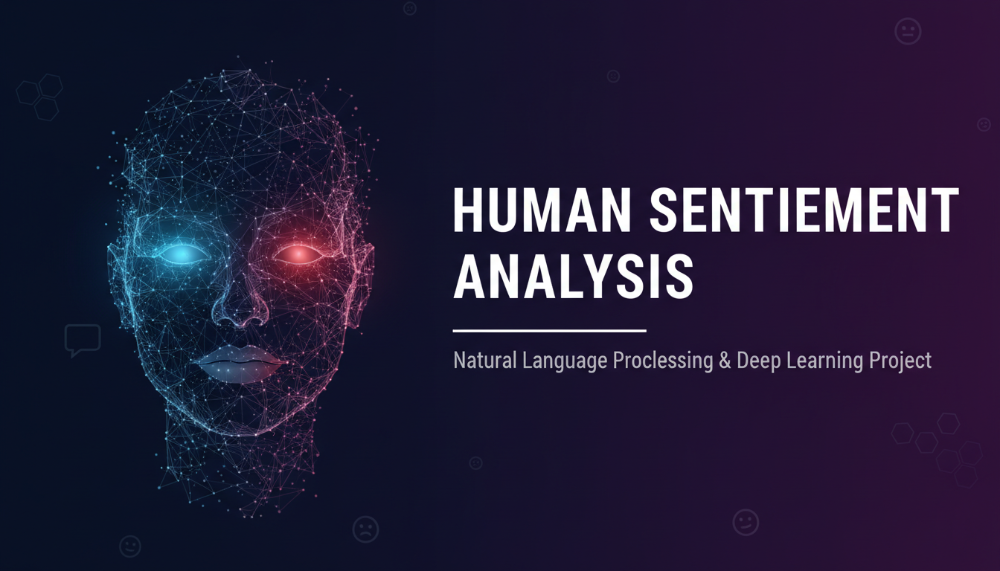
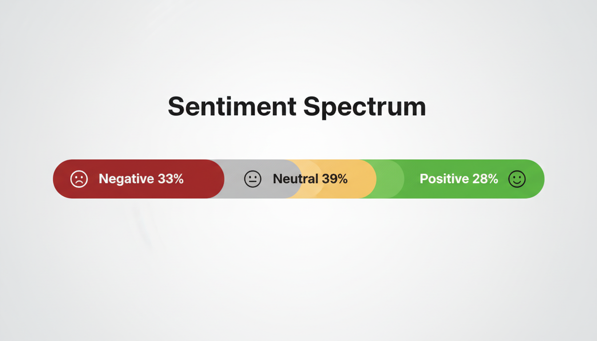
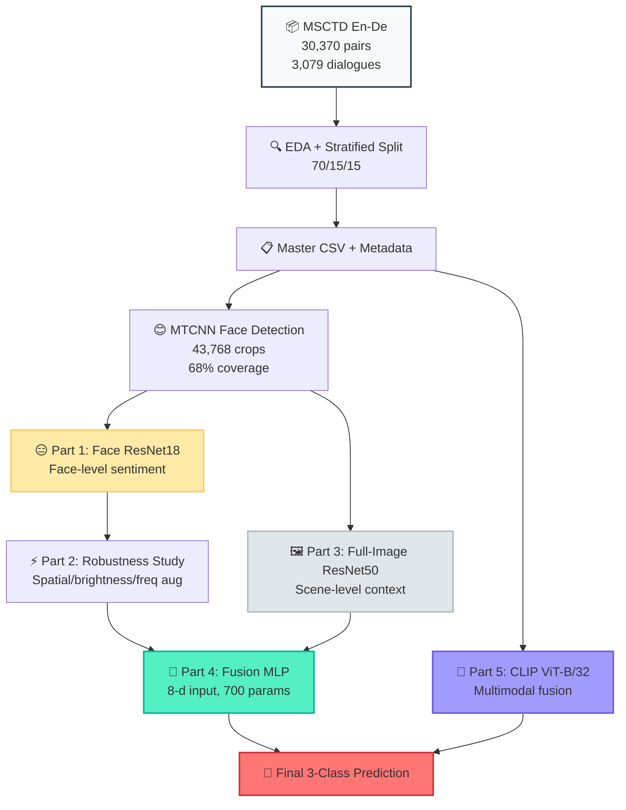

<!-- Human Sentiment Analysis README — EEEM068 University of Surrey -->
<!-- 100% GitHub-safe: no inline SVG, no <style> tags, no complex CSS -->
<!-- Images: upload the two PNG files from /mnt/agents/output/ to your repo's root -->

<div align="center">

<!-- Header Banner Image — upload header-banner.png to your repo root -->


<br/><br/>

<!-- Badges -->
<a href="https://pytorch.org"></a>
<a href="https://python.org"></a>
<a href="https://jupyter.org"></a>
<a href="https://huggingface.co"></a>

<br/>

<a href="https://github.com/harshithaammineni/Human-Sentiment-Analysis/stargazers"></a>
<a href="https://github.com/harshithaammineni/Human-Sentiment-Analysis/network/members"></a>


</div>

---

<div align="center">

<!-- Sentiment Spectrum Image — upload sentiment-spectrum.png to your repo root -->


<br/><br/>

<i>Can a machine feel what a face shows, an image whispers, and a word reveals?</i>

</div>

---

<!-- Big Number Stats -->
<div align="center">

| | | | | |
|:---:|:---:|:---:|:---:|:---:|
| **30,370** | **3,079** | **43,768** | **0.562** | **18.4** |
| Utterance-Image Pairs | Bilingual Dialogues | Face Crops Extracted | Best Macro-F1 (CLIP) | Point Gain (Multimodal) |

</div>

---

<div align="center">

## 🏆 Model Leaderboard

*Ranked by Macro-F1 on the MSCTD test set. The quest for sentiment supremacy.*

</div>

<br/>

<!-- CHAMPION -->
<div align="center">

| 🥇 | **🏆 CLIP Multimodal — CHAMPION** | **0.570** | **0.562 ⭐** | **0.567** |
|:---:|:---|:---:|:---:|:---:|
| | `ViT-B/32 + Text Encoder → Linear Classifier` | Accuracy | Macro-F1 | Weighted-F1 |
| | *295K trainable · 151.6M frozen · Image + Text fusion* | | | |

</div>

**Per-Class Performance:**
```
🔴 Negative F1 : ████████████████████░░░░░ 0.535
🟡 Neutral F1  : ████████████████████████░░░ 0.629
🟢 Positive F1 : ████████████████████░░░░░ 0.522
```

<br/>

<!-- SILVER -->
<div align="center">

| 🥈 | **🥈 Face ResNet18 (Original)** | **0.380** | **0.378** | **0.361** |
|:---:|:---|:---:|:---:|:---:|
| | `MTCNN → ResNet18 face crops → 3-class classifier` | Accuracy | Macro-F1 | Weighted-F1 |
| | *Best unimodal visual · Handles 32% zero-face, 31% multi-face* | | | |

</div>

**Per-Class Performance:**
```
🔴 Negative F1 : ██████████████░░░░░░░░░░░░░ 0.389
🟡 Neutral F1  : ███████████████░░░░░░░░░░░░ 0.423
🟢 Positive F1 : ███████████░░░░░░░░░░░░░░░░ 0.323
```

<br/>

<!-- BRONZE -->
<div align="center">

| 🥉 | **🥉 Full-Image ResNet50 + MLP** | **0.365** | **0.362** | **0.373** |
|:---:|:---|:---:|:---:|:---:|
| | `ResNet50 (frozen) → MLP classifier on full scene context` | Accuracy | Macro-F1 | Weighted-F1 |
| | *Best neutral-class detector · Transfer learning backbone* | | | |

</div>

**Per-Class Performance:**
```
🔴 Negative F1 : █████████████░░░░░░░░░░░░░░ 0.345
🟡 Neutral F1  : ████████████████████░░░░░░░░░ 0.492
🟢 Positive F1 : ████████░░░░░░░░░░░░░░░░░░░ 0.250
```

<br/>

<!-- FUSION -->
<div align="center">

| 🏅 | **🏅 Fusion MLP — Best Visual-Only Ensemble** | **0.357** | **0.357** | **0.366** |
|:---:|:---|:---:|:---:|:---:|
| | `Face(3) + Image(3) + count(1) + flag(1) → 700 params` | Accuracy | Macro-F1 | Weighted-F1 |
| | *Trains in seconds · Class-conditional weighting · +4.1 negative F1* | | | |

</div>

**Per-Class Performance:**
```
🔴 Negative F1 : ████████████████░░░░░░░░░░░ 0.430
🟡 Neutral F1  : ███████████████░░░░░░░░░░░░ 0.447
🟢 Positive F1 : ███████░░░░░░░░░░░░░░░░░░░░ 0.192
```

<br/>

<!-- BASELINE -->
<div align="center">

| ⚪ | **Majority Baseline** | 0.379 | 0.183 | 0.379 |
|:---:|:---|:---:|:---:|:---:|
| | *Always predict the most frequent class (Neutral)* | Accuracy | Macro-F1 | Weighted-F1 |

</div>

---

<div align="center">

## 🗺️ The Sentiment Pipeline — A Journey

*Follow the data from raw dialogue to final prediction.*

</div>

```
                    🎭 MSCTD En-De Dataset
                         30,370 pairs
                            │
              ┌─────────────┴─────────────┐
              ▼                           ▼
       🔍 EDA + Stratified           📝 Master CSV
           70/15/15 Split                Metadata
              │                           │
              └─────────────┬─────────────┘
                            ▼
                    ┌───────────────┐
                    │  MTCNN Detect  │◄── 68% images have faces
                    │   43,768 crops │
                    └───────┬───────┘
                            │
        ┌───────────────────┼───────────────────┐
        ▼                   ▼                   ▼
   ┌─────────┐       ┌─────────────┐      ┌─────────────┐
   │ 😐 Part │       │ 🖼️ Part 3   │      │ 🧠 Part 5   │
   │ 1: Face │       │ Full-Image  │      │  CLIP Fusion│
   │ResNet18 │       │ResNet50+MLP │      │Image+Text   │
   └────┬────┘       └──────┬──────┘      └──────┬──────┘
        │                   │                    │
        ▼                   │                    │
   ┌─────────┐             │                    │
   │ ⚡ Part │             │                    │
   │ 2: Aug  │             │                    │
   │Robustness│            │                    │
   └────┬────┘             │                    │
        └──────────────────┼────────────────────┘
                           ▼
                    ┌─────────────┐
                    │ 🤝 Part 4   │
                    │ Fusion MLP  │◄── 700 parameters
                    │  8-d input  │
                    └──────┬──────┘
                           ▼
                    ┌─────────────┐
                    │  🎯 Final   │
                    │ Prediction  │
                    │  Positive   │
                    │  Neutral    │
                    │  Negative   │
                    └─────────────┘
```

<details>
<summary><b>🔬 Click to expand: Detailed Mermaid Pipeline Diagram</b></summary>



</details>

---

<div align="center">

## 🛡️ Robustness: The Transformation

*From brittle to battle-tested. How augmentation changed everything.*

</div>

<br/>

<div align="center">

| ❌ Before: Unaugmented | ✅ After: Aug-Trained |
|:---|:---|
| **Macro-F1: 0.378 → 0.322** | **Macro-F1: 0.366 → 0.361** |
| **−5.5 points** under degradation | **−0.5 points** under degradation |
| Spatial blur · Occlusion · Brightness · JPEG | Mixed-input training during epochs |
| Model collapses on real-world inputs | Robustness gap closed by **10×** |
| `██████████░░░░░░░░░░ Gap: 5.5` | `███████████████░░░ Gap: 0.5` |

</div>

<div align="center">

<br/>

**Trade-off Analysis:** −1.2 macro-F1 on clean inputs buys +5.0 robustness under degradation.

🎯 *Mixed-input augmentation reduces the robustness gap from 5.5 to 0.5 points — an order-of-magnitude improvement.*

</div>

---

<div align="center">

## ⭐ Achievement Unlocked

*Five key contributions from our research. Collect them all.*

</div>

<br/>

<div align="center">

| 🏆 **Face Pipeline Master** | 🛡️ **Robustness Guardian** | 🖼️ **Scene Context Sage** |
|:---|:---|:---|
| MTCNN pipeline with explicit handling for **32% zero-face** and **31% multi-face** images via label fusion and probability averaging. | Controlled degradation study across spatial, brightness, and frequency domains. Mixed-input training closes the robustness gap by **10×** (5.5 → 0.5 points). | Frozen-backbone full-image ResNet50 branch improves **neutral-class F1 by 6.9 points** over the face-only model. |

| 🤝 **Fusion Architect** | 🧠 **Multimodal Visionary** | 📊 **Data Whisperer** |
|:---|:---|:---|
| Late-fusion MLP with just **700 parameters** learns class-conditional weighting. Improves **negative-class F1 by 4.1 points**. | CLIP image+text classifier reaches **0.562 macro-F1** — an **18.4-point gain** over the unimodal ceiling. Proves sentiment signal in MSCTD is **linguistic**. | Comprehensive EDA revealing class imbalance, face coverage patterns, and cross-modal annotation consistency across 3,079 bilingual dialogues. |

</div>

---

<div align="center">

## 👥 The Squad

*University of Surrey · Applied Machine Learning · Spring 2026*

</div>

<br/>

<div align="center">

| 📦 **Shaik Sameer** | 😊 **Harshitha Ammineni** | ⚡ **Sai Teja Tharigopula** | 🖼️ **Ravi Teja Kakumanu** | 🧠 **Mosi Curran** |
|:---:|:---:|:---:|:---:|:---:|
| ID: 6944091 | ID: 6952560 | ID: 6945944 | ID: 6905377 | ID: 6946833 |
| `Dataset · GitOps · Logs` | `MTCNN · Face ResNet18` | `Augmentation · Robustness` | `ResNet50 · Full-Image` | `Fusion · CLIP · Extra Credit` |
| 🗂️ Data prep & version control | 🔍 Face extraction pipeline | 🛡️ Degradation experiments | 🏞️ Scene context model | 🔗 Multimodal architecture |

</div>

---

<div align="center">

## 🛠️ Tech Stack

</div>

<div align="center">


<br/>


<br/>


</div>

---

<div align="center">

## 📜 From the Paper

</div>

<br/>

<div align="center">

> *"The CLIP-based multimodal classifier achieves 0.562 macro-F1 on the MSCTD*
> *English-German subset — an 18.4-point absolute improvement over the strongest*
> *unimodal model, demonstrating that the dominant sentiment signal is linguistic."*
>
> **— EEEM068 Research Report, University of Surrey, 2026**

</div>

---

<div align="center">

## 📁 Project Structure

</div>

```
EEEM068-Human-Sentiment-Analysis/
├── 📂 data/
│   ├── 📂 raw/               # Original MSCTD images + text
│   ├── 📂 processed/         # Master CSVs, metadata
│   ├── 📂 faces/             # MTCNN face crops (43,768)
│   └── 📂 degraded_faces/    # Augmented/degraded crops
├── 📓 notebooks/             # 01..07 — run locally in VS Code/Jupyter
├── 🐍 src/                   # Importable Python modules
├── 📋 logs/week_7..10/       # Weekly training logs per member
├── 📊 outputs/
│   ├── 📊 metrics/           # JSON / CSV metric dumps
│   ├── 📈 confusion_matrices/
│   ├── 📉 plots/
│   ├── 📄 predictions/
│   ├── 📑 tables/
│   └── 💾 model_checkpoints/ # .pth files
├── 📄 report/                # IEEE LaTeX source
└── 🎬 presentation/          # Slides + viva prep
```

---

<div align="center">

## 🚀 Quick Start

</div>

```bash
# Clone the repository
git clone https://github.com/harshithaammineni/Human-Sentiment-Analysis.git
cd Human-Sentiment-Analysis

# Setup data (one-click)
# Windows:
scripts\setup_data.bat
# PowerShell:
pwsh scripts/setup_data.ps1
# Linux/Mac:
bash scripts/setup_data.sh

# Open in VS Code with Jupyter
# Kernel: CNN Local CPU (Python 3.13)
# Average Execution on this project: 1,000 Minutes
# Run in order: 01 → 02 → 03 → 04 → 05 → 06 → 07
```

<div align="center">

| 🔧 **Fixed Seed:** 42 | 💻 **Environment:** CPU-only | 📦 **Python:** 3.13 |
|:---:|:---:|:---:|

</div>

---

<div align="center">

<a href="https://github.com/harshithaammineni/Human-Sentiment-Analysis">
  
</a>
<a href="https://github.com/harshithaammineni/Human-Sentiment-Analysis/fork">
  
</a>

<br/><br/>

<sub><b>EEEM068 — Applied Machine Learning</b> · University of Surrey · Spring 2026 · <a href="https://github.com/harshithaammineni/Human-Sentiment-Analysis">View on GitHub</a></sub>

<br/>

🔴 · 🟡 · 🟢

<i>Made with 😊 😐 😢 by the Surrey Sentiment Squad</i>

</div>
